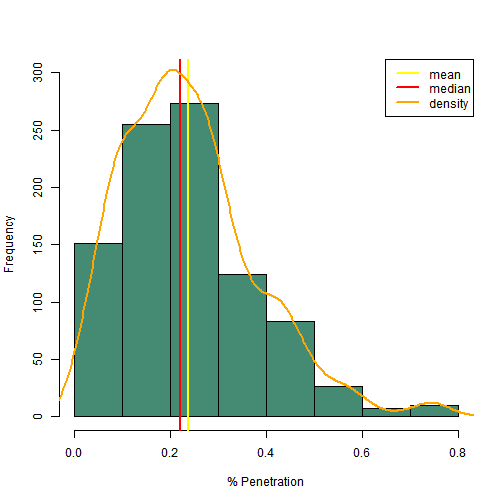

## Medicare Advantage

#### Medicare is the government sponsored health insurance for the elderly (age >= 65) and the disabled in the United States of America. It provides both hospital and professional (i.e. doctor) care.

#### Medicare <b>Advantage</b> is Medicare that is provided through a private health plan that includes managed care and possibly additional benefits such as home health care or vision care. 

#### As of September 2014 there are <b>49,296,440</b> Medicare eligibles in the USA, and only <b>15,646,951</b> are enrolled in a Medicare Advantage plan. That results in a total penetration of only <b>0.317%</b>.

#### Ref: http://www.cms.gov/Research-Statistics-Data-and-Systems/Statistics-Trends-and-Reports/MCRAdvPartDEnrolData/MA-State-County-Penetration-Items/MA-State-County-Penetration-2014-09.html

## Core Based Statistical Area

#### A Core Based Statistical Area, or CBSA, is "... a core area containing a substantial population nucleus, together with adjacent communities having a high degree of economic and social integration with that core." These can be either metropolitan areas (population > 50,000), or micropolitan areas (population between 10,000 and 50,000). An example of a metropolitan area would be New York City, which would not only include the five burroughs, but the surrounding counties and parts of New Jersey and Pennsylvania.

#### Ref: http://www.census.gov/geo/reference/gtc/gtc_cbsa.html

--- .class #id 

## Shiny App

The Medicare penetration file includes data on the county level. I wanted to group the data by CBSA. I combined to two datasets based on the FIPS county code, and summed the number of enrolled and eligible by CBSA. 

My Shiny App creates a sortable, filterable dataset. You can manipulate the data viewed by the number of eligibles and the penetration percentage. The resulting dataset is also sortable by clicking in the column headings.

http://kirkshanks.shinyapps.io/MedicareAdv

---

## MA Penetration by CBSA

 

---

## Sources

http://www.census.gov/geo/reference/gtc/gtc_cbsa.html

http://www.cms.gov/Research-Statistics-Data-and-Systems/Statistics-Trends-and-Reports/MCRAdvPartDEnrolData/MA-State-County-Penetration-Items/MA-State-County-Penetration-2014-09.html

